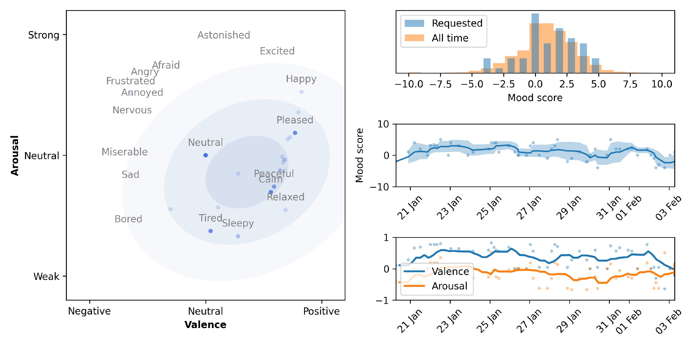

# tg-howwasyourday-v2

A Telegram bot for tracking your mood and emotional state over time. It periodically asks "how was your day?", collects a mood score and emotion tags, stores everything in InfluxDB, and lets you view stats and trends.

## How it works

1. The bot sends you a reminder at a random time within your configured window.
2. You rate your current general state from **-10** (worst) to **+10** (best). Values outside this range are automatically clamped.
3. You pick one or more emotions from a predefined list.
4. Your entry is saved. Over time, `/get_stats` shows you plots of your mood history, emotion distribution on the Russell map, and valence/arousal trends.

## Commands

| Command | Description |
|---|---|
| `/start` | Start a mood entry |
| `/get_stats` | Generate a stats plot for a chosen time range |
| `/settings` | Configure reminder window, toggle reminders/weekly summary, change language |
| `/show_russell_map` | Show the Russell emotion map |
| `/feedback <message>` | Send a message directly to the admin |
| `/help` | Show the help message |
| `/cancel` | Cancel the current operation |

**Admin only**

| Command | Description |
|---|---|
| `/admin_stats` | Show aggregate stats: registered users, active users (7d/30d), total entries, top 10 and least used emotions |



## Emotion theory

It seems that our brain have two independent neurophysiological systems, thus any attempt to represent an emotional states ends up to be two deminetional [[Colibazzi, T. et al (2010)](https://doi.org/10.1037/a0018484); [Posner, J. et al. (2009)](https://doi.org/10.1037/h0077714)]. In this bot emotions are placed on the **Russell circumplex model of affect** [(Russell, 1980)](https://doi.org/10.1037/h0077714). The model represents emotional states in a 2D space:

- **Valence** (x-axis): how pleasant or unpleasant the emotion feels, from -1 (very negative) to +1 (very positive).
- **Arousal** (y-axis): how activated or deactivated you are, from -1 (very calm/sleepy) to +1 (very energized).

For example: *Excited* sits high-valence + high-arousal; *Relaxed* is high-valence + low-arousal; *Angry* is low-valence + high-arousal; *Bored* is low-valence + low-arousal.

When you select multiple emotions in one session, the bot stores their mean valence and arousal, giving a single point on the circumplex that represents your overall affective state for that entry.


## Running with podman 

Containers and poetry are not good frieds, so its easier to live with `requirements.txt`:
```shell
poetry export -f requirements.txt --output requirements.txt --without-hashes
```

Build image
```shell
podman build -t howwasyourday-bot .
```
Run
```shell
podman run -d\
    --env TELEGRAM_BOT_TOKEN=''\
    --env ALLOWED_CHAT_IDS="123, 124"\
    --env LILYA_ID=\
    --env INFLUXDB_TOKEN=''\
    --env INFLUXDB_URL='http://localhost:8086'\
    --env INFLUXDB_ORG='home'\
    --env INFLUXDB_BUCKET='howwasyourday_testing'\
    --env DUE_MINIMAL_H=3\
    --env DUE_MAXIMAL_H=8\
    --env NAMES_FOR_LILYA_JSON="['', '', '']"\
    --env ADMIN_CHAT_ID=123\
    --env PUBLIC_ACCESS=false
    localhost/howwasyourday-bot
```

## Running with poetry
Or it can be run with just poetry but one needs to install [this plugin](https://github.com/mpeteuil/poetry-dotenv-plugin)
```shell
poetry self add poetry-dotenv-plugin
```
and create `howwasyourdaybot/.env` file
```shell
TELEGRAM_BOT_TOKEN='token'
ALLOWED_CHAT_IDS='123, 1234'
LILYA_ID=123
INFLUXDB_TOKEN='token'
INFLUXDB_URL='http://localhost:8086'
INFLUXDB_ORG='home'
INFLUXDB_BUCKET='bucket'
DUE_MINIMAL_H=3
DUE_MAXIMAL_H=8
NAMES_FOR_LILYA_JSON='["name1", "name2", "name3"]'
ADMIN_CHAT_ID=123
# PUBLIC_ACCESS=true  # uncomment to open the bot to everyone (ignores ALLOWED_CHAT_IDS)
```

### Manage with systemd

Change `howwasyourdaybot.service` file and copy it 
```bash
cp howwasyourdaybot.service ~/.config/systemd/user/howwasyourdaybot.service
```
Start the service
```bash
systemctl --user enable --now howwasyourdaybot.service
```
Since it is a userwide service, don't forget to do this
```bash
loginctl enable-linger your_user_name
```

### Self updates

Self updates can be managed by the `self-update.sh` script and `cron`. Setup by running `crontab -e`
```shell
0 5 * * * /bin/bash /path/to/self-update.sh
```
This will run it daily at 5am. You can check the current cronjobs by `crontab -l`.
Don't forget to make `gh auth login`.

## TODO

1. ✅ Usage stats for the admin — done (`/admin_stats`)
2. ✅ User feedback  — done (`/feedbacks`)
3. Emotions descriptions
4. Mood notes, journaling
5. Streak feature
6. User settings using json
